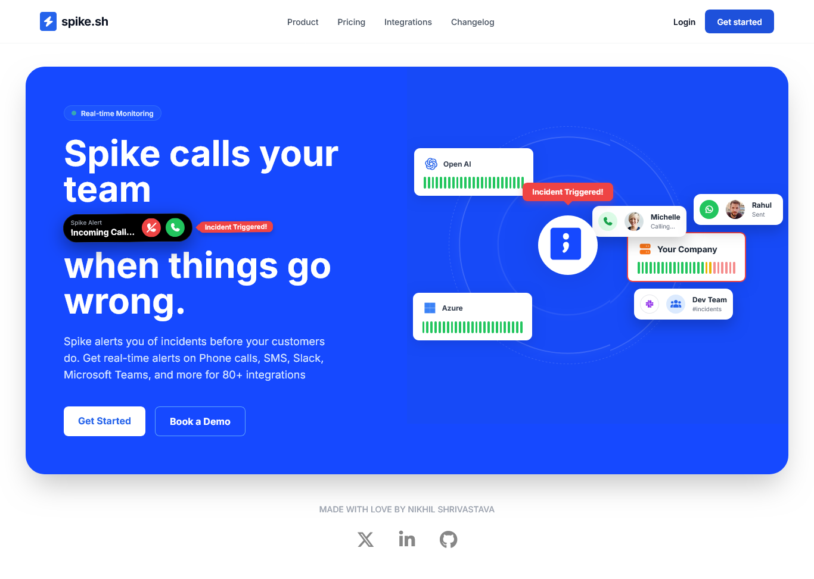

# Spike.sh Redesigned

A modern, interactive redesign of the Spike.sh website, showcasing real-time monitoring and incident alerting capabilities with stunning animations and a clean UI/UX.

## 🚀 Features

- **Real-time Monitoring Dashboard**: Visualize system health with animated orbit systems and live data graphs.
- **Interactive Call Simulation**: Experience incident alerts with phone call UI and team notifications.
- **Responsive Design**: Fully responsive layout that works seamlessly on desktop, tablet, and mobile devices.
- **Smooth Animations**: Powered by GSAP for fluid transitions and engaging user interactions.
- **Modern UI/UX**: Clean, professional design with Tailwind CSS for consistent styling.

## 🛠️ Technologies Used

- **HTML5**: Semantic markup for structure.
- **CSS3**: Custom styles with Tailwind CSS for utility-first styling.
- **JavaScript**: Interactive functionality and animations.
- **GSAP**: High-performance animations library.
- **Font Awesome**: Icon library for visual elements.

## 📸 Screenshots

### Rough Wireframe


### Final Website Screenshot


## 🚀 Getting Started

1. Clone the repository:
   ```bash
   git clone https://github.com/your-username/spike-sh-redesigned.git
   ```

2. Navigate to the project directory:
   ```bash
   cd spike-sh-redesigned
   ```

3. Open `index.html` in your preferred web browser.

## 👨‍💻 About the Developer

Hi, I'm Nikhil Shrivastava, a passionate frontend developer with expertise in modern web technologies. I specialize in creating interactive, user-friendly web applications and have a keen interest in AI-assisted development.

### Skills & Expertise
- **Frontend**: HTML, CSS, JavaScript, React, Tailwind CSS, TypeScript, Storybook
- **Backend**: Flask, FastAPI, Python, Database Management
- **AI-Assisted Development**: Leveraging tools like GitHub Copilot for enhanced productivity
- **Frameworks**: Proficient in recreating designs in React, Next.js, or any preferred framework

## 💼 Hire Me

I'm currently seeking opportunities as a **Frontend Intern** or **AI-Assisted Full-Stack Developer Intern**. If you're impressed by this project and believe my skills align with your team's needs, I'd love to discuss potential roles!

### Why Hire Me?
- Proven ability to recreate and enhance existing designs
- Experience with modern web technologies and AI tools
- Passionate about clean code, great UX, and innovative solutions
- Quick learner and adaptable to new frameworks and technologies

### Contact
- **Email**: nikhil.shrivastava304@gmail.com
- **LinkedIn**: [linkedin.com/in/nikhil304](https://linkedin.com/in/nikhil304)
- **GitHub**: [github.com/nikhil-304](https://github.com/nikhil-304)
- **Twitter**: [x.com/NikhilShri304](https://x.com/NikhilShri304)

Feel free to reach out for collaborations, internships, or just to connect!

## 📄 License

This project is for demonstration purposes. Please respect intellectual property rights.

---

*Made with ❤️ by Nikhil Shrivastava*